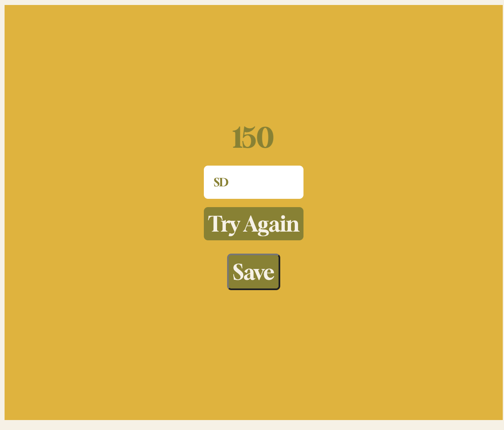

# Quiz

## Description

The goal of this project is to leveraging javascript to create a dynamic quiz interface for the app, including function such as timer, moving to next question, increase score when having the correct answer and record/sorting score in the dashboard. 

## Installation

github, javascript, and live serve to monitor the actual movement from the console and local storage. 

## Usage

### index html 
I have begin the task by created a simple html, i.e. homepage with two buttons to go to the quiz html or leaderboard html. 

### quiz html
I then have created a quiz html to provide a format of the elements featured in the quiz container, which includes timer and score as well as the actual questions. 

By linking the quiz javascript to the html file, where I have recored the actual questions and answers, it allows when selecting the correct answer, there is an increase in score by 50 points. Further, by refeencing the answer number with the choice index, when the selected answer and choice are equal, it feels a true statement in the console and changes colour to the according assigned class. 

### record html 
This is where it allows the users to save the score by putting in the selected user names, this then being saved to the local storage and displayed to the leaderboard page. 

### leaderboard page
By using sort function, the page displays the top ten records from the previous section, this sort should be sorted by the scores, from the highest to lowest. 

## Credits

Steven Dong 

and tutorials from youtube: includes: https://www.youtube.com/watch?v=3fbU4z7fPe4; 
                                     https://www.youtube.com/watch?v=PIiMSMz7KzM; 
                                     https://www.youtube.com/watch?v=49pYIMygIcU. 

## License

MIT License

Copyright (c) 2023 StevenDong2512

Permission is hereby granted, free of charge, to any person obtaining a copy
of this software and associated documentation files (the "Software"), to deal
in the Software without restriction, including without limitation the rights
to use, copy, modify, merge, publish, distribute, sublicense, and/or sell
copies of the Software, and to permit persons to whom the Software is
furnished to do so, subject to the following conditions:

The above copyright notice and this permission notice shall be included in all
copies or substantial portions of the Software.

THE SOFTWARE IS PROVIDED "AS IS", WITHOUT WARRANTY OF ANY KIND, EXPRESS OR
IMPLIED, INCLUDING BUT NOT LIMITED TO THE WARRANTIES OF MERCHANTABILITY,
FITNESS FOR A PARTICULAR PURPOSE AND NONINFRINGEMENT. IN NO EVENT SHALL THE
AUTHORS OR COPYRIGHT HOLDERS BE LIABLE FOR ANY CLAIM, DAMAGES OR OTHER
LIABILITY, WHETHER IN AN ACTION OF CONTRACT, TORT OR OTHERWISE, ARISING FROM,
OUT OF OR IN CONNECTION WITH THE SOFTWARE OR THE USE OR OTHER DEALINGS IN THE
SOFTWARE.
